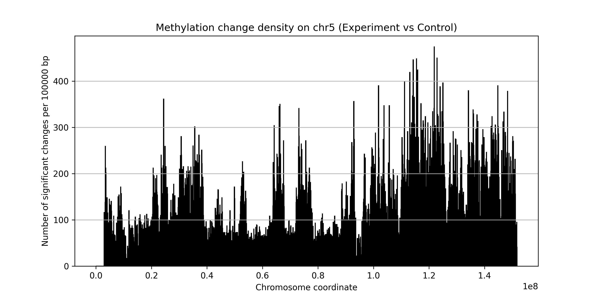

# Methylation Change Analysis Tool

## Overview
This script analyzes differences in methylation signals between control and experimental datasets. It identifies regions with significant changes and visualizes the change density across a selected chromosome.

## Features
- Supports tab-delimited input files containing chromosome coordinates and signal values.
- Filters data by a user-defined chromosome.
- Identifies significant changes based on a threshold.
- Filters regions by minimum size.
- Calculates and visualizes change density along the chromosome.
- Exports results as a text file and a plot.

## Requirements
- Python 3
- Libraries: `pandas`, `matplotlib`, `tkinter`

## Environment Setup
Since this script was developed on **Windows Subsystem for Linux (WSL)**, ensure the following steps are completed:

1. Install WSL and Ubuntu:
   ```bash
   wsl --install
   sudo apt update && sudo apt upgrade
   ```

2. Install Python and required libraries:
   ```bash
   sudo apt install python3 python3-pip
   pip3 install pandas matplotlib
   ```

3. Enable graphical display for `tkinter` (optional if running from WSL console):
   ```bash
   sudo apt-get install python3-tk
   ```

## Preparing Input Files
This script expects **tab-delimited** files with the following format:
```
chr    start    end    signal
```
If you start from **BigWig (.bw)** files, convert them first to BED or TSV using `bigWigToBedGraph`:
```bash
bigWigToBedGraph input.bw output.bedgraph
```
Then reformat to the expected structure (e.g., using `awk`):
```bash
awk '{print $1"\t"$2"\t"$3"\t"$4}' output.bedgraph > formatted_data.tsv
```

## Running the Script
1. Launch the script:
   ```bash
   python3 methylation_analysis.py
   ```

2. Select the control and experimental data files.
3. Enter the following parameters when prompted:
   - Chromosome (e.g., `chr1`)
   - Difference threshold (percentage)
   - Minimum region size (bp)
   - Window size for density visualization (bp)

4. The script outputs:
   - A text file with significant changes: `significant_changes_<chromosome>.txt`
   - A visualization plot: `methylation_changes_<chromosome>.png`

## Example Output
- **Significant changes text file:**
   ```
   chr    start    end    signal_control    signal_experiment    diff
   chr1   10000    10100  0.3                0.6                 0.3
   chr1   20000    20100  0.4                0.1                -0.3
   ```

- **Change density plot:**
   

## Notes
- Ensure data files are clean and formatted correctly.
- For large chromosomes, consider adjusting `window_size` to balance performance and resolution.


